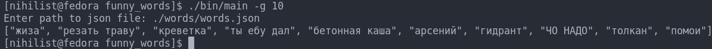

# funny_words

Simple light-weight CLI program that writes in console funny words.



## Installation

Download the latest release from Releases or compile it yourself.

```bash
git clone https://github.com/UberNihilist/cli_funny_words.git
```

If you have downloaded Crystal then do:

```bash
shards build 
```

or:

```bash
crystal build path --release
```

## Usage

```bash
./funny_words [options]
```

Then enter path to **words.json**

## Development

* General guides
  * Use **double** quotes

* JSON guides
  * Try not to add words that exists

* Code guides
  * Use `block` syntax instead of `do...end` if it's possible

## Contributing

1. Fork it (<https://github.com/UberNihilist/cli_funny_words/fork>)
2. Create your feature branch (`git checkout -b my-new-feature`)
3. Commit your changes (`git commit -am 'Add some feature'`)
4. Push to the branch (`git push origin my-new-feature`)
5. Create a new Pull Request
